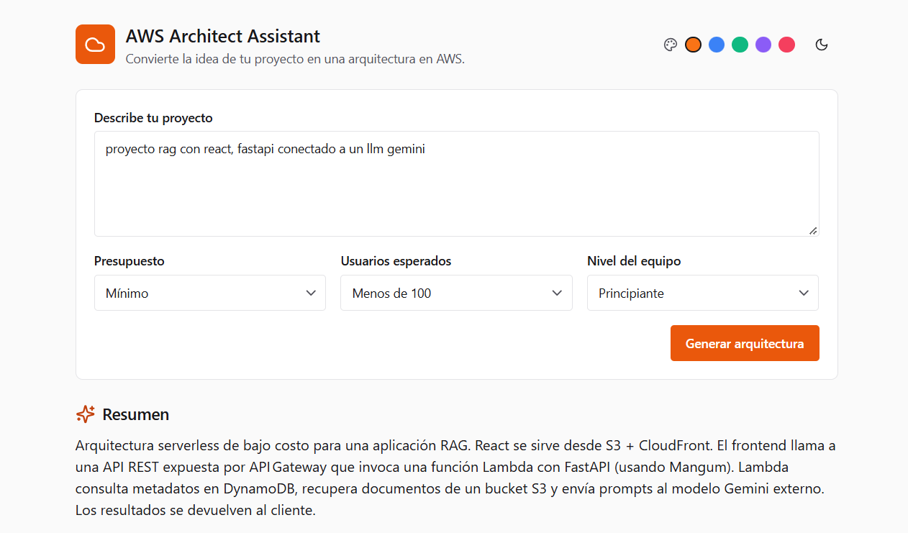
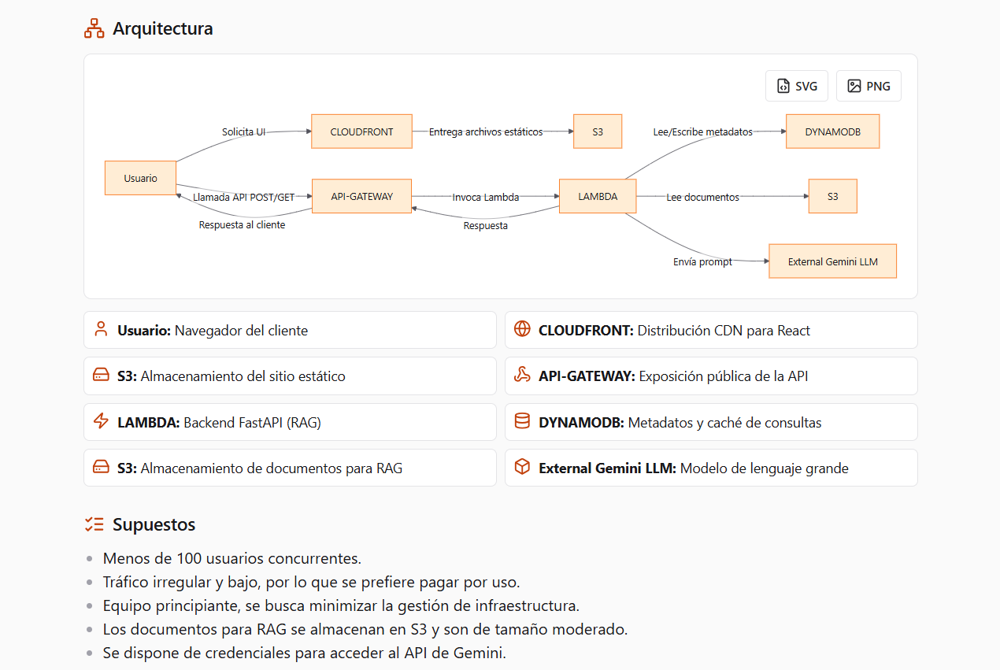
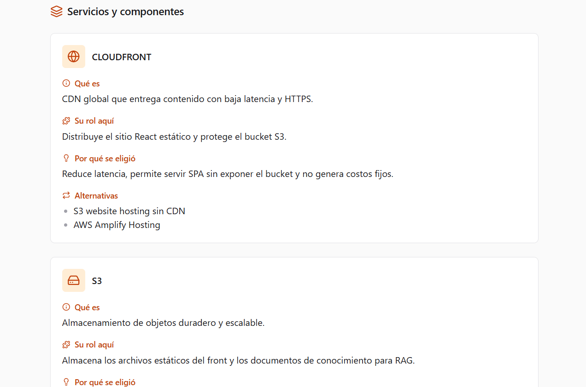

# AWS Architect Assistant

Describe tu idea de proyecto y la app devuelve una arquitectura en AWS (diagrama) con la explicación de cada servicio.

**Stack:** React + Vite + TS + Chakra UI v3 · FastAPI · PostgreSQL + pgvector · embeddings locales (`intfloat/multilingual-e5-small`) · Groq (`openai/gpt-oss-120b`).

## Puesta en marcha

### 1. Base de datos
```bash
docker compose up -d
```

### 2. Backend
```bash
cd backend
python -m venv .venv && source .venv/bin/activate   # Windows: .venv\Scripts\activate
pip install -r requirements.txt
cp .env.example .env        # edita OPENAI_API_KEY
python -m scripts.ingest    # indexa data/docs en pgvector
uvicorn app.main:app --reload
```
API en http://localhost:8000/docs

### 3. Frontend
```bash
cd frontend
pnpm install
pnpm dev
```
App en http://localhost:5173 (el proxy de Vite envía `/api` al backend).

## Screenshots

### Architecture Advisor



### Generated Architecture



### Architecture Details

